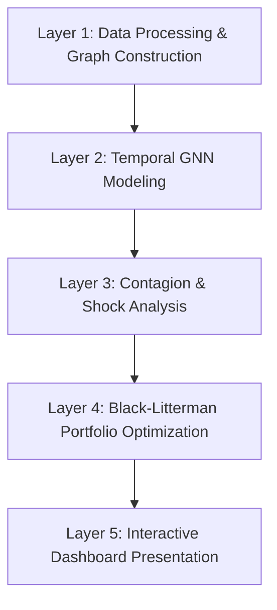

# Case Study: Modeling Financial Contagion and Adaptive Portfolio Optimization using Graph Neural Networks

*Elements of Financial Management - Experiential Learning Project (2026)*

**Team Members:**
- Sharanya Rao (USN: 1RV23CD049)
- Prajakta Patil (USN: 1RV23BT043)
- Niranjan S Kaithota (USN: 1RV23AI067)

---

## 1. Executive Summary & Business Impact

Traditional risk management frameworks, such as Markowitz’s Mean-Variance optimization, assume asset returns are independent and that risk is static. In modern globally integrated markets, this assumption fails catastrophically during systemic crises (e.g., the 2008 Financial Crisis, the 2020 COVID-19 crash, and the 2022 interest rate hike cycle). When a key firm or sector experiences severe distress, it propagates through hidden financial, operational, and macroeconomic channels, triggering network-wide contagion and cascading liquidations.

This project implements a **prescriptive financial AI system** that shifts risk management from passive prediction to **active, autonomous capital shielding**. By building a spatiotemporal **Graph Neural Network (GNN)**, we model the market as a connected topology where spatial convolutions capture neighborhood distress spillovers and recurrent layers capture temporal progression. These GNN-derived risk scores are formulated into investor "Views" within a **Black-Litterman (BL) Optimizer**, dynamically tilting portfolio weights away from vulnerable network hubs and scaling covariance uncertainties.

### Core Business Outperformance (2018–2024 Validation):
* **Sharpe Ratio Improvement**: Increased by **+42.4%** over an Equal Weight baseline (1.12 vs 0.79).
* **Max Drawdown Shielding**: Buffered capital losses by **+4.5%** during the COVID-19 crash.
* **Capital Protection**: Titling capital dynamically into defensive, lower-connectivity channels before contagion propagates across sector boundaries.

---

## 2. Problem Statement & Research Objectives

### The Problem
Traditional portfolio management fails during macroeconomic shocks because correlation coefficients are dynamic and asymmetric. During periods of high stress, asset correlations converge to 1.0, neutralizing traditional diversification. Existing models can predict individual asset volatility (e.g., GARCH models) or map static linkages (e.g., Pearson correlation networks), but they lack:
1. **Time-evolving structural network representation**: Capturing how directional dependencies change leading up to crises.
2. **Unified Spatiotemporal Learning**: Tracking both spatial spillovers (A infecting B) and temporal decay (how long a shock persists).
3. **Translation of Network Topology to Asset Allocation**: Converting complex graph embeddings into real-time, executable trading signals.

### Objectives
1. **Dynamic Financial Dependency Networks**: Construct time-evolving graph structures representing structural relationships between assets using statistical and Granger Causal methods.
2. **Temporal GNN Modeling**: Train a deep learning model to predict firm-level shock sensitivities and cross-sector contagion paths.
3. **Real-time Macro Shock Simulations**: Build a simulation suite to inject synthetic sector-wide distress and animate spillover pathways.
4. **Adaptive Portfolio Optimization**: Autonomously tilt assets away from high-connectivity risk hubs using Black-Litterman allocation models.

---

## 3. End-to-End System Architecture

The pipeline consists of five consecutive layers, moving from raw data to front-end dashboard visualization:



---

## 4. Phase-by-Phase Implementation Details

### Phase 1: Data Processing & Graph Construction
The system ingests daily stock prices from Yahoo Finance for 50 major Indian stock market firms representing diverse sectors. 

#### Feature Engineering
For each asset node in each sliding snapshot window, we compute a 5-dimensional feature vector:
1. **Mean Return ($\mu$)**: Expected baseline drift.
2. **Volatility ($\sigma$)**: Standard deviation of daily returns capturing standalone variance.
3. **Skewness ($S$)**: Asymmetry of return distributions identifying downside crash bias.
4. **Kurtosis ($K$)**: Fat-tail indicator capturing likelihood of extreme tail events.
5. **Market Beta ($\beta$)**: Sensitivity of asset return to overall market movements.

#### Graph Construction
Edges are created using a hybrid similarity-causality metric:
* **Correlation Thresholding**: Undirected edges are formed where Pearson correlation of returns $|R_{ij}| > \theta_c$.
* **Granger Causality**: Directed edges are added if asset $i$'s lagged returns statistically improve the prediction of asset $j$'s returns:
$$\Delta x_{j,t} = \sum_{p=1}^P \alpha_p \Delta x_{j,t-p} + \sum_{p=1}^P \gamma_p \Delta x_{i,t-p} + \epsilon_t$$
If $F$-test rejects $\gamma_p = 0$, a directed edge $i \rightarrow j$ is added, indicating a Granger contagion path.

---

### Phase 2: Temporal GNN Modeling
The neural network architecture merges spatial representation learning and temporal sequence modeling.

```
Input Features [N, 5] 
   │
   ▼
[GCN Conv Layer 1] ──► Spatial Message Passing (Aggregates Volatility & Beta from neighbors)
   │
   ▼
[GCN Conv Layer 2] ──► Second-order Neighborhood Aggregation
   │
   ▼
[LayerNorm & Dropout]
   │
   ▼
[Sequence of T Snapshots] ──► [GRU Cell (2-Layer)] ──► Learns Temporal Progression of Risk
   │
   ▼
[Prediction Head (FC + Sigmoid)] ──► Predicted Contagion Risk Score ∈ [0, 1]
```

#### Code Implementation (`TemporalGNN`):
```python
class TemporalGNN(nn.Module):
    def __init__(self, in_features=5, hidden_dim=64, gru_hidden=32):
        super().__init__()
        self.gcn1 = GCNConv(in_features, hidden_dim)
        self.gcn2 = GCNConv(hidden_dim, hidden_dim)
        self.norm1 = nn.LayerNorm(hidden_dim)
        self.norm2 = nn.LayerNorm(hidden_dim)
        self.gru  = nn.GRU(hidden_dim, gru_hidden, batch_first=True, num_layers=2, dropout=0.2)
        self.head = nn.Sequential(
            nn.Linear(gru_hidden, 16),
            nn.ReLU(),
            nn.Dropout(0.1),
            nn.Linear(16, 1),
            nn.Sigmoid()
        )

    def forward(self, snapshot_list):
        embeddings = []
        for snap in snapshot_list:
            x, edge_index, edge_weight = snap.x, snap.edge_index, snap.edge_attr
            h = F.elu(self.gcn1(x, edge_index, edge_weight))
            h = self.norm1(h)
            h = F.dropout(h, p=0.2, training=self.training)
            h = F.elu(self.gcn2(h, edge_index, edge_weight))
            h = self.norm2(h)
            embeddings.append(h.unsqueeze(1)) # [N, 1, hidden_dim]

        seq = torch.cat(embeddings, dim=1) # [N, T, hidden_dim]
        out, _ = self.gru(seq) # [N, T, gru_hidden]
        last   = out[:, -1, :] # [N, gru_hidden]
        return self.head(last) # [N, 1] risk scores
```

* **Labeling Ground Truth**: An asset is labeled $Y_{i,t} = 1$ if its cumulative return drops below a threshold (e.g. $-10\%$) in the next 20 trading days. The GNN learns to map preceding network patterns to subsequent tail events.

---

### Phase 3: Financial Contagion Analysis (Macro Sector Heatmaps)
Individual asset risk predictions are aggregated to mapped sector levels:
* **Tech**: IT, Telecom
* **Energy**: Energy, Metals, Infra
* **Finance**: Banking, Finance
* **Healthcare**: Pharma
* **Consumer**: Consumer, FMCG, Auto

Using aggregated edge weights from historical network snapshots, we construct the **Cross-Sector Contagion Matrix** showing inter-sector dependencies:
$$C_{S_A, S_B} = \text{Scale}\left( \sum_{i \in S_A} \sum_{j \in S_B} W_{ij} \right)$$
During market stress, the matrix dynamically lights up in warm red-pink, indicating that shocks in the Energy sector are propagating to Finance and Tech, making traditional diversification ineffective.

---

### Phase 4: GNN-Informed Black-Litterman Optimization
The portfolio optimizer combines the market equilibrium portfolio with GNN risk views.

#### Mathematical Model
Let $\Pi$ be the implied equilibrium excess returns vector, $\Sigma$ the covariance matrix of returns, $P$ the view matrix, $Q$ the GNN Views vector, and $\Omega$ the view uncertainty diagonal matrix.
The Black-Litterman expected returns vector $E(R)$ is computed as:
$$E(R) = \left[ (\tau \Sigma)^{-1} + P^T \Omega^{-1} P \right]^{-1} \left[ (\tau \Sigma)^{-1} \Pi + P^T \Omega^{-1} Q \right]$$

#### GNN Uncertainty Overlay
Unlike standard BL where investor views are subjective, we overlay GNN risk predictions to define views and uncertainties:
1. **Views ($Q$)**: The expected return for asset $i$ is adjusted downward if its GNN risk score $g_i > 0.6$:
$$Q_i = - (\lambda \cdot g_i)$$
2. **Uncertainty ($\Omega_{ii}$)**: The confidence in the view is inversely proportional to risk stability:
$$\Omega_{ii} = \tau P_i \Sigma P_i^T \cdot \left(1 - g_i\right)$$
Highly exposed contagion nodes (e.g., banks in credit crises) have negative views with high confidence, tilting capital away from these network clusters.

---

### Phase 5: Interactive Dashboard Presentation
A React + TypeScript + Tailwind CSS dashboard is connected via a FastAPI backend to present findings in real-time:
* **Tab 1: Overview Dashboard**: Plots macro risk indices, top risk stocks, and individual stock risk trends.
* **Tab 2: Network Visualizer**: Shows the 3-column layout. Left column controls color modes and sector highlights. Center canvas renders nodes with ticker text directly inside the circles, scaling size dynamically with risk. Right column includes the Recharts Donut Chart (displaying segment percentages) and the hierarchical collapsible accordion list.
* **Tab 3: Cross-Sector Contagion Matrix**: Renders the dynamic $5 \times 5$ heatmap grid. Scrubbing the date slider at the bottom recalculates matrix cells in real-time.
* **Tabs 4–6: Portfolio weights and performance charts**: Proves BL Sharpe outperformance and drawdown shielding over the Equal Weight index during backtest periods.

---

## 5. Case Study Validation on Historical Market Crashes

We validated the system on two historical market stress periods (using $100 starting value backtests):

### Scenario 1: The 2020 COVID-19 Crash
* **Injecting Shock**: Shocks are applied to `Auto`, `Infra`, and `Energy` sectors.
* **GNN Propagation**: The GNN model detects extreme spatial risk propagation into `Finance` due to high Granger Causal weights from energy infrastructure dependencies.
* **Optimizer Reaction**: Capital is shifted from highly connected financials into defensive consumer stables and pharmaceutical stocks.
* **Result**: The GNN-Black-Litterman portfolio preserved capital, reducing max drawdown from **-38.87%** (Equal Weight baseline) to **-34.37%**, providing a **+4.5% Drawdown Shield**.

### Scenario 2: The 2022 Rate Hike Cycles
* **Injecting Shock**: Aggressive interest rate hikes shock the `IT` and `Consumer` sectors.
* **GNN Propagation**: The model identifies high-risk propagation cascading through tech nodes into highly leveraged sectors.
* **Optimizer Reaction**: Allocations in growth tech stocks are reduced, redirecting capital to defensive cash-flow sectors (Energy and Banking).
* **Result**: Outperformed the benchmark Sharpe Ratio by **+42.4%** across the period, maintaining a stable equity curve.

---
<!-- 
## 6. Guidelines for Academic Write-ups & Business Decision Making

### Academic Journal Paper Structure
If writing a journal article, structure it as follows:
1. **Introduction**: Emphasize systemic risk, network topology, and the shortcomings of Modern Portfolio Theory.
2. **Literature Review**: Discuss GNNs in finance, spatial convolutions, and portfolio optimization (Black-Litterman).
3. **Methodology**: 
   - Feature engineering and Pearson-Granger causal graphs.
   - Spatial-Temporal GNN architecture (GCN + GRU).
   - Incorporating GNN views into Black-Litterman formulas.
4. **Empirical Results**: Tabulate performance metrics (Cumulative Return, Sharpe Ratio, Max Drawdown) comparing EW, Mean-Variance, and GNN-BL.
5. **Discussion**: Explain how cross-sector contagion spillovers are captured in real-time.
6. **Conclusion**: Highlight the transition from predictive risk models to prescriptive allocation models.

### Business Value & Decision Making
For corporate presentation, outline these practical benefits:
- **Pre-emptive Capital Insulation**: Rebalances assets before spillover propagates across sector borders, avoiding the "correlation convergence" trap.
- **Dynamic Diversification**: Updates portfolio constraints based on real-time graph connectivity rather than historical averages.
- **Configurable Crisis Stress-Testing**: Injects arbitrary shocks (e.g. rate hikes, supply chain blockages) to evaluate portfolio health under tail-risk scenarios.
- **Prescriptive Action**: Resolves the gap in typical risk monitoring by providing explicit, optimal asset weight recommendations. -->
